# READ ME

# System Overview

This is a lightweight mobile planner designed for people with ADHD, who require assistance with everyday task planning, without heavy setup or complexity that comes with the majority of calander/scheduling applications. It focuses on quick task capture and clear time awareness. Tasks are organized into simple time lists to keep track of todays tasks, while future items move into view as deadlines approach. A simple daily schedule is created from your tasks and can be adjusted by dragging, with the app rebalancing the schedule to resolve conflicts. Helpful reminders can alert you to upcoming start times and deadlines, with adjustable reminder lead timing. The aim is calm, low-effort daily planning that is easy to fit into real life.

# Features

## List View & Tasks

- Tasks are items containing a title and options to include deadline, duration, reminders.

- The List View displays a list of existing tasks, sorted into tabs for Today/Week/Month/All. Tasks in later lists will move forward as their deadline approaches.

- The List view includes a button to create new Tasks.

- Tapping Tasks in the list allows you to edit, complete, or delete the task.

- The task add/edit popup opens as a bottom sheet.

- Completed items stay visible until end of day.

- Drag and move. Drag tasks between lists edge auto swipe. If moving a task beyond its deadline, it will prompt the user for a new deadline.

- The All tab is view only and not a drop target.

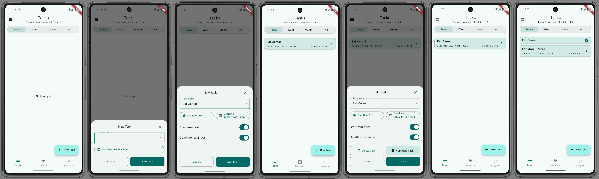

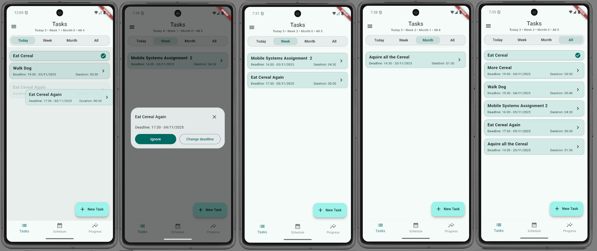

## Schedule View

- The Schedule View contains 3 tabs for Today/Week/Month (Currently only the Today Schedule is implemented).

- The Today Schedule displays a vertically scrolling schedule, broken into 30 minute slots with time stamps. The schedule is generated based on the Schedule Start/End times (adjustable in settings).

- Tasks in the Today list are automatically placed into the schedule, at the earliest point within the schedule start/end times.

- Tasks in the schedule are sized based on the task duration, and snap to the grid at 5 minute intervals.

- Tasks can be dragged around the schedule to adjust their starting/ending times. The scheduler automatically resolves conflicts by moving the other tasks around to the nearest legal position.

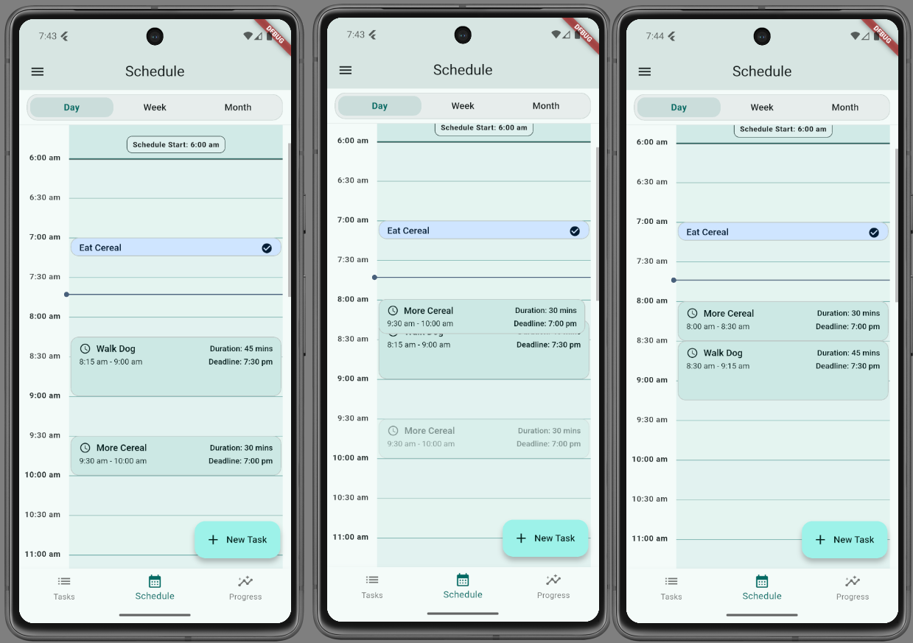

## Progress View

- The Progress View shows a summary of the users productivity over the selected Time Window (Today/Week/Month).

- It contains a level bar showing the users current Level as well as CurrentExperience/RequiredExperience for the next level.

- The Tasks progress bar shows visualizes the completion of the required task for each List (CompletedTasks/PlannedTasks).

- The Progress View also contains a stats grid, which contains additional statistics relating to the users progress (currently only Completed Tasks and Planned Tasks).
  This will be expanded to include additional statistics e.g. Completion Rate, Streaks, and more.

- Progress metrics update live when tasks are completed, edited, rescheduled, or durations change.

- Exp is currently calculated based on the task duration, and is awarded when tasks are completed. The Level Exp Thresholds are currently hard coded.

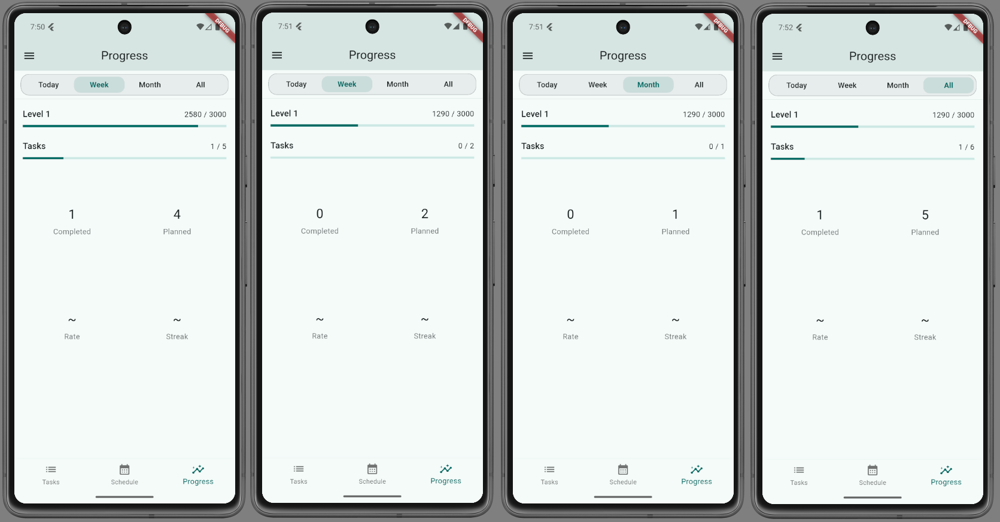

## Settings and Notifications

- The settings screen is accessed with the button on the top left of the other screens.

- It allows the user to customize UserSettings including: notificationsEnabled, defaultTaskDuration, reminderLeadTime, scheduleStart/End times.

- Schedule Start/End in Settings define the Today schedules visible work window and the resitrctions for Task placement and behavior in the Schedule.

- Notification toggles exist per task (remindOnStart, remindOnDeadline) and a global notificationsEnabled setting is toggleable in the settings.

- On Android, accurate timing for notifications requires the app to have Exact Alarm permission on the device.
  The Settings screen includes a button that navigates to the devices required Permission settings so the user can enable it.
  These notifications work both inside and outside the app.

- Editing a task, moving it, or changing settings triggers rescheduleReminders to update alarms idempotently based on current flags, schedule slots, and permission state.

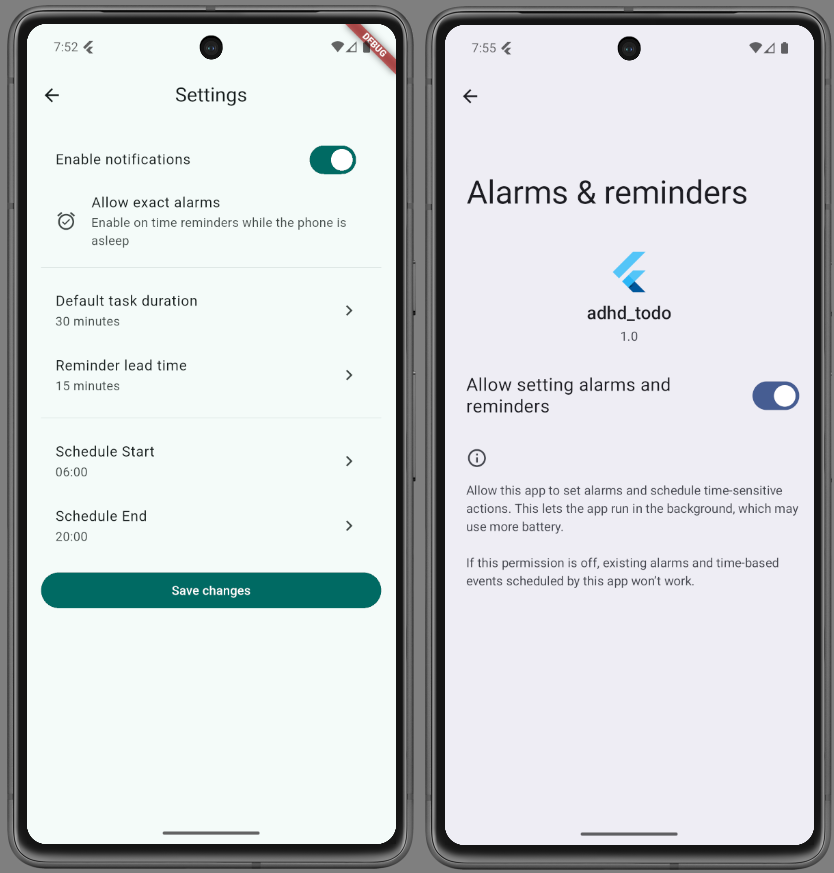

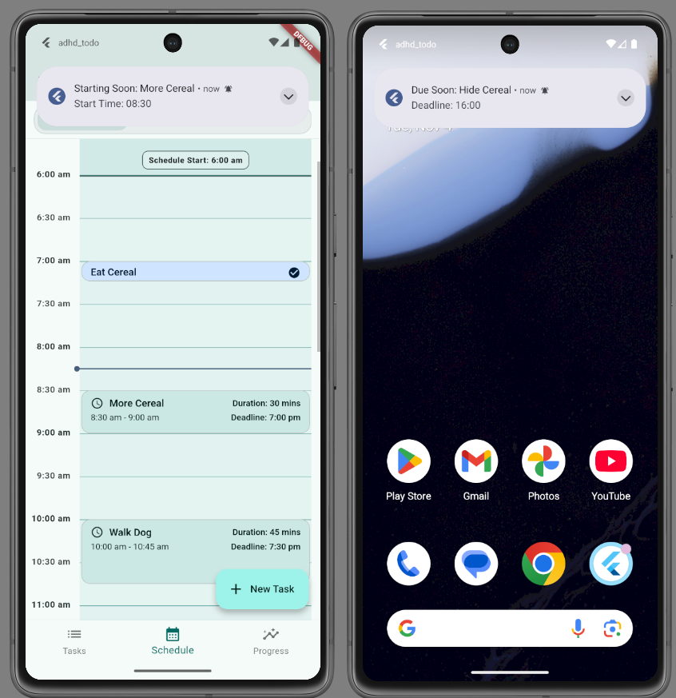

# Setup Instructions

**Platform support:** Android only.

- iOS requires macOS + Xcode to build so this had to be moved out-of-scope for this project.

**Device Support:**

- Android emulators running Android 15 (API level 35), with a x86_64 system image.
- Devices using Android 15

## Setup & Run

### Quick Run (Pre-built APK)

1. **Download the APK** from the repo:  
   `build/app/outputs/flutter-apk/app-debug.apk`
2. **Install on an Android phone or emulator:**
   - **Phone:** copy the APK to the device and open it.
   - **Emulator:** start an Android Studio emulator, then drag/drop the APK onto it  
     _(or use: `adb install -r path/to/apk`)_
3. **Open the app**  
   To enable exact alarms, go to the app settings and click **“Enable Exact Alarms.”**

---

## Full Project (Full IDE Project Folder)

### Requirements

- **Flutter SDK (stable)**
  - https://docs.flutter.dev/install
  - Follow install instructions
- **Android SDK + Platform Tools + Emulator** _(easiest via Android Studio)_
  - https://developer.android.com/studio
  - Launch **Android Studio**
  - Install **Android 15.0 SDK**, **35.0.0 SDK Build Tools**, **Android SDK Platform Tools**, **Android Emulator**
- _(Optional)_ **VS Code** with **Flutter** & **Dart** extensions

### Setup

- Download the entire **GitHub** repository
- Open the project in an **IDE**
- Verify in the terminal:  
  flutter doctor -v
- Install Dependencies:  
  flutter clean
  flutter pub get
- Run the flutter widget tests:  
  flutter test

### Run

- Start an Android emulator (Android Studio or other IDE) or connect a phone with USB debugging enabled. Then use:
  flutter pub get
  flutter devices
  flutter run -d <deviceId>

## Evaluation Tests

> The following manual tests validate core list, schedule, reminder, and progress behaviors.

### Test 1: Zero setup first launch

**Goal**  
Confirm the app opens to the Today List Screen on a fresh install.

**Actions**

- Install the app on a clean device profile.
- Open the app.

**Expected Result**

- The app opens on the Today List Screen.
- No configuration is required.

**Screenshots**

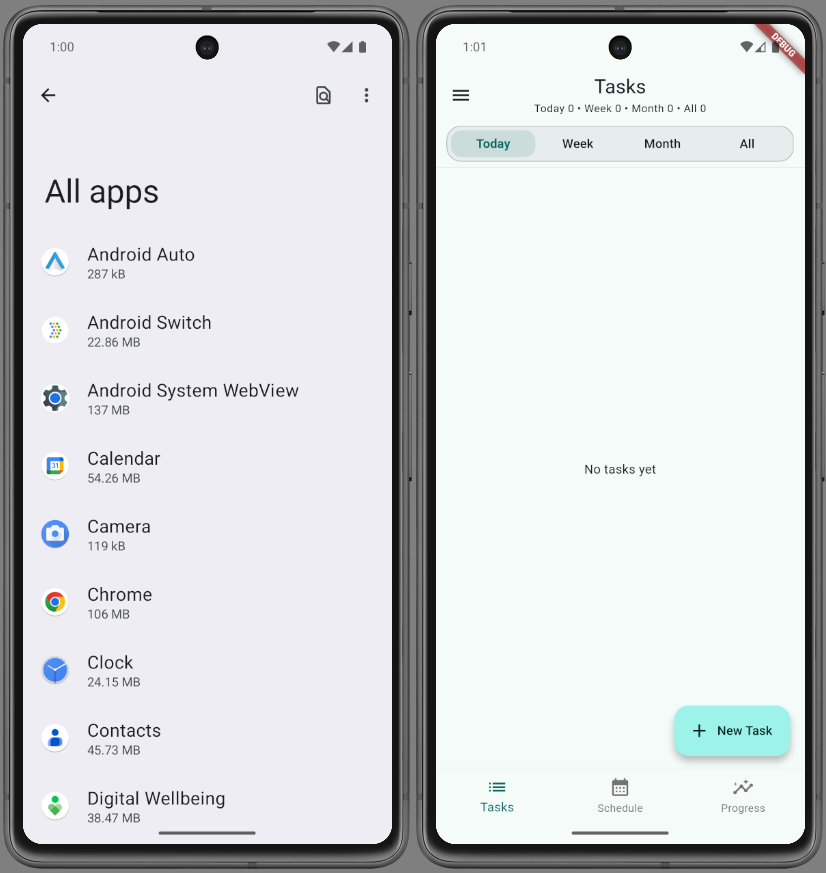

- Clean install, app launch, and Today List Screen visible. The final image shows no extra setup required.

---

### Test 2: Quick Task Creation

**Goal**  
Verify a title‑only task is created and shown immediately.

**Actions**

- On the Today List Screen.
- Tap **Add Task**.
- Enter a task title only.
- Save the task.

**Expected Result**

- The task appears in the Today List immediately.
- The task has no deadline.
- The task has the default duration of 30 minutes by default (adjustable in settings).

**Screenshots**

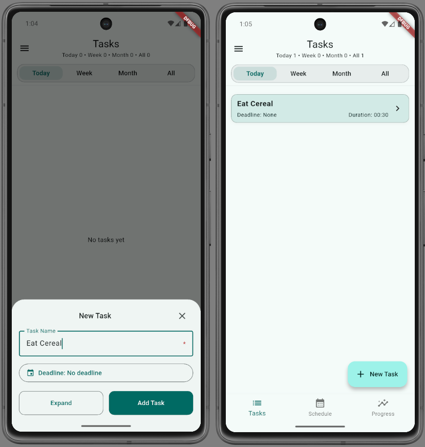

- Tapping **Add Task**, entering only a title, and saving. The last image shows the task in the Today List with no deadline and the default duration.

---

### Test 3: Task creation (expanded)

**Goal**  
Verify creation with deadline, duration, and reminders.

**Actions**

- Open the **Expanded Add Task** form.
- Enter a title.
- Set a deadline.
- Set a duration.
- Toggle reminders on.
- Save the task.

**Expected Result**

- The task appears in the correct **Today** / **Week** / **Month** based on the deadline.
- The task shows the correct deadline.
- The task shows the correct duration.
- The task shows reminders remain enabled.

**Screenshots**

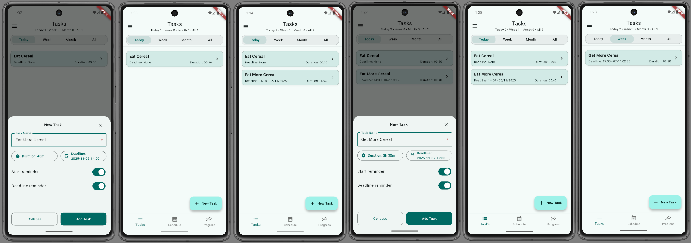

- Entering a title, setting a deadline and duration, and enabling reminders. The final images shows the task in the correct list with the correct deadline, duration, as well as the edit task popup showing reminders toggled on.

---

### Test 4: Edit Task

**Goal**  
Confirm edits apply and display in the correct list.

**Actions**

- Tap on an existing task.
- Change the title.
- Change the duration.
- Change the deadline.
- Toggle reminders on or off.
- Save the task.

**Expected Result**

- The task shows the updated title.
- The task shows the updated duration.
- The task shows the updated deadline.
- The task shows the updated reminder state.
- The task is visible in the correct list based on the new deadline.

**Screenshots**

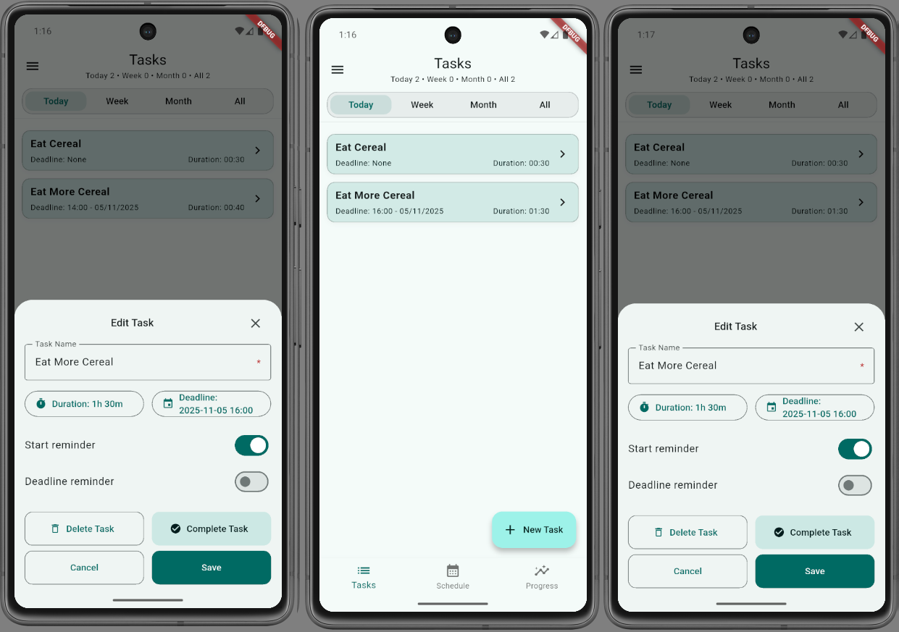

- Opening a task and changing title, duration, deadline, and reminder toggles. The final image shows the updated chips and text in the correct list.

---

### Test 5: Complete Task

**Goal**  
Confirm a task can be completed and minimized in the list.

**Actions**

- Tap on a visible task.
- Tap **Complete Task**.

**Expected Result**

- The task is marked as completed.
- The task container is minimized in the list.

**Screenshots**

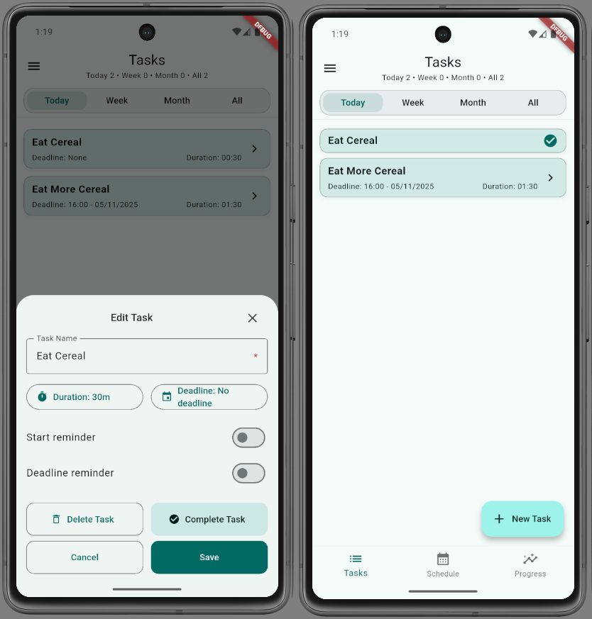

- Tapping **Complete** on a visible task. The last image shows the task marked completed with the minimized container.

---

### Test 6: Delete Task

**Goal**  
Confirm a task can be removed from all lists.

**Actions**

- Tap on a visible task.
- Tap **Delete Task**.
- Confirm deletion if prompted.

**Expected Result**

- The task is removed from all lists.

**Screenshots**

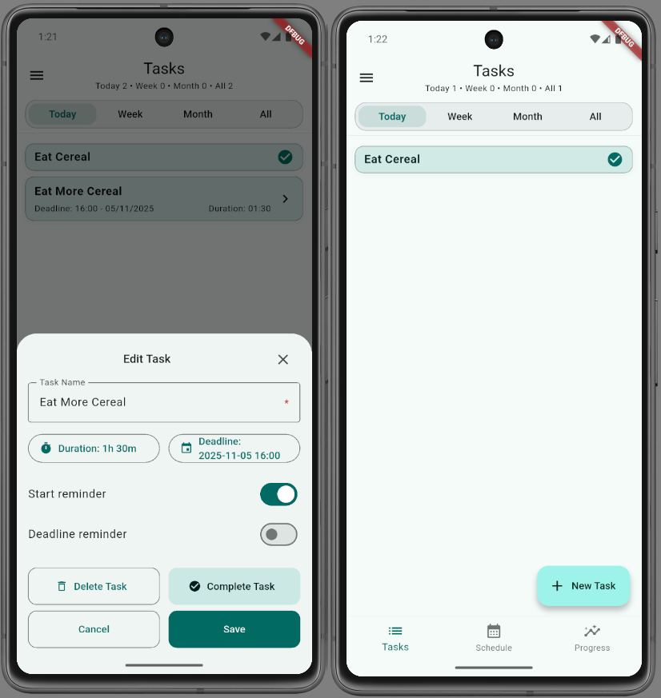

- Selecting a task and confirming deletion. The final image shows the task removed from all lists.

---

### Test 7: Drag Task to Later List

**Goal**  
Verify drag to a list handles deadline conflicts.

**Actions**

- Select a task with a deadline.
- Drag the task to a later list that starts after the current deadline.
- Respond to the deadline prompt.

**Expected Result**

- A prompt asks for a new deadline.
- If the prompt is ignored the deadline is removed.
- The task appears in the target list.

**Screenshots**

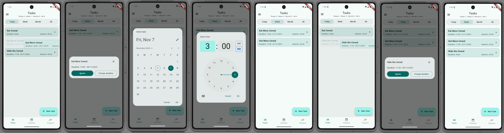

- Dragging a task to a later list and the prompt for a new deadline. The last image shows the task in the target list after ignoring the prompt with the deadline removed.

---

### Test 8: Drag Task to Earlier List

**Goal**  
Verify drag to an earlier list updates the view immediately.

**Actions**

- Select a task with or without a deadline.
- Drag the task to a list that starts earlier or at the same time as the current deadline.

**Expected Result**

- The task appears in the new list immediately.

**Screenshots**

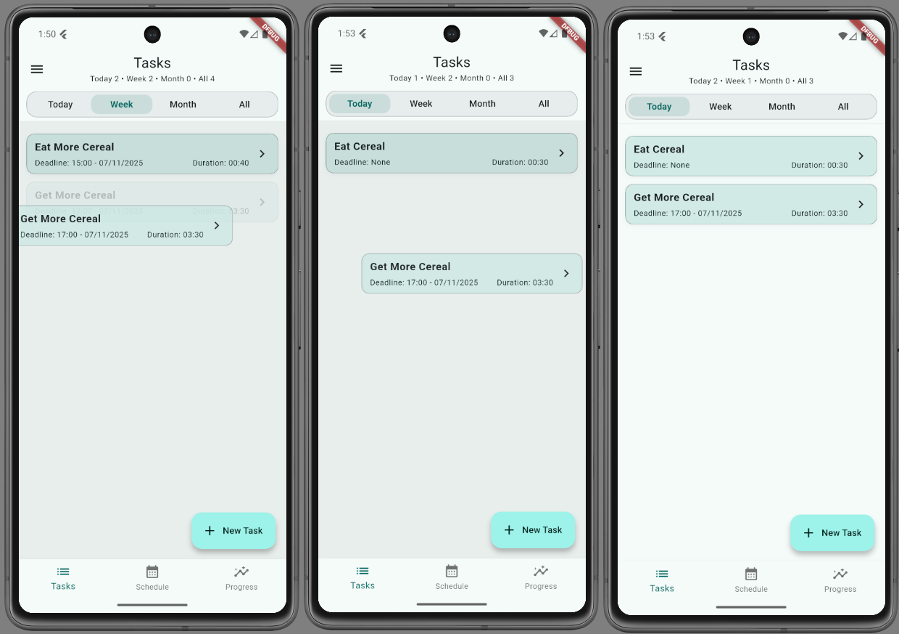

- Dragging a task to an earlier list. The last image shows the task visible in the new list immediately.

---

### Test 9: List Categories

**Goal**  
Confirm each list category shows the correct tasks.

**Actions**

- Ensure tasks exist with different deadlines.
- Open the **Today** list.
- Open the **Week** list.
- Open the **Month** list.
- Open the **All** list.

**Expected Result**

- **Today** shows only tasks due today and overdue active tasks if applicable.
- **Week** shows tasks in the current week window.
- **Month** shows tasks in the current month window.
- **All** shows all tasks based on the product rules.

**Screenshots**

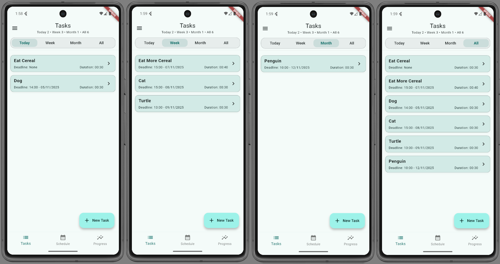

- Opening **Today**, **Week**, **Month**, and **All** in order. Each image shows the correct tasks for that category and matching counts.

---

### Test 10: Auto schedule

**Goal**  
Verify tasks in Today appear on the Schedule with scaled sizes.

**Actions**

- Ensure tasks exist in the **Today** list.
- Open the **Schedule** view.

**Expected Result**

- Each task appears in the schedule.
- Task blocks are scaled by task duration.
- No unexpected overlaps are introduced.

**Screenshots**

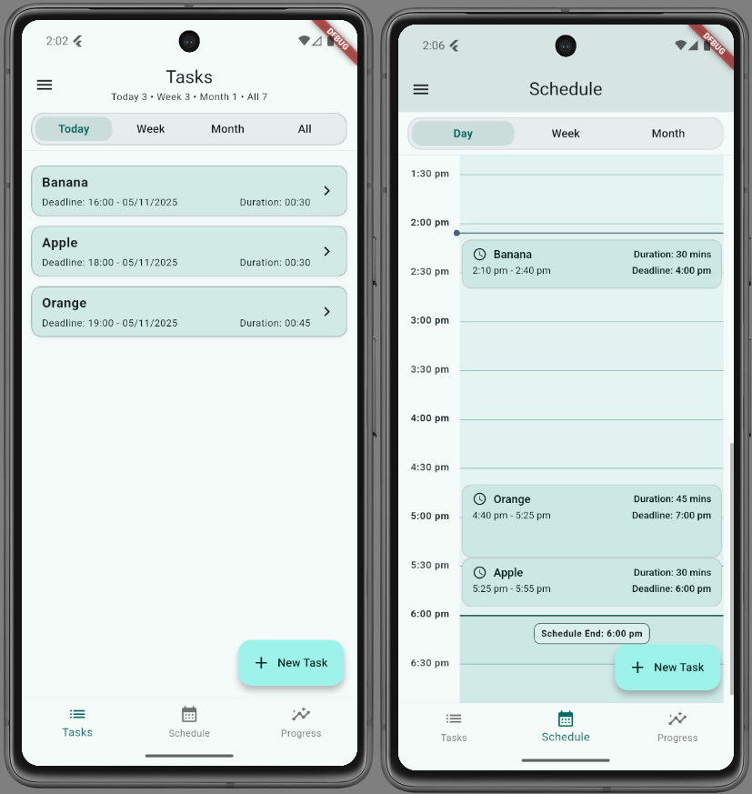

- The **Today** list and then the **Schedule** view. The final image shows each task placed on the schedule with block sizes scaled by duration and no unexpected overlaps.

---

### Test 11: Drag and drop with rebalance

**Goal**  
Confirm schedule drag updates times and rebalances neighbors.

**Actions**

- Select a scheduled task.
- Drag the task to a new time slot.
- Drop the task.

**Expected Result**

- The task remains in the new time slot.
- The start time and end time update correctly.
- Conflicting tasks move to the nearest available time within schedule hours.
- No task starts before the current time.

**Screenshots**

- A scheduled task being dragged to a new slot and dropped. The final image shows the task in the new time with adjusted start/end and neighbor tasks moved to available times.

---

### Test 12: Reminders

**Goal**  
Verify reminder notifications are sent at the correct lead time.

**Actions**

- Have a task with start time or deadline approaching.
- Toggle reminders on.
- Ensure notification permissions are enabled.
- Wait for the reminder time.

**Expected Result**

- A notification is sent at the correct lead time of 15 minutes by default.
- The lead time can be changed in Settings.

**Screenshots**

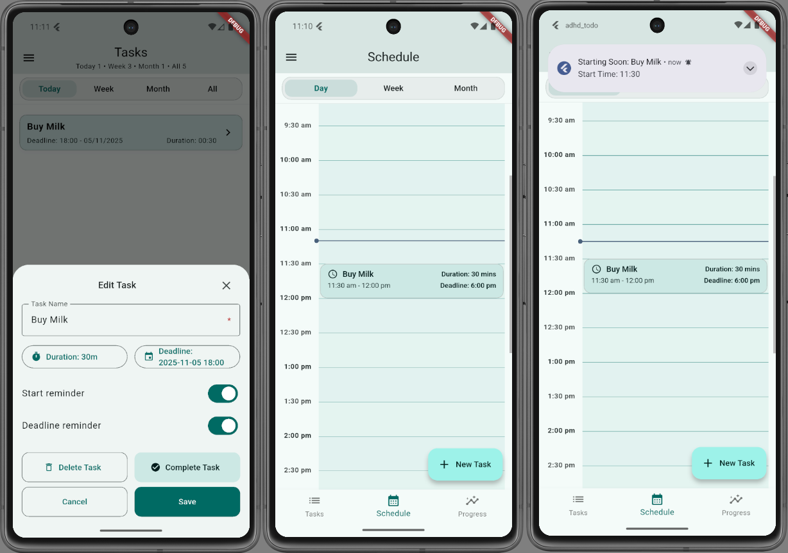

- A task with reminders enabled and notification permissions on. The final image shows the notification arriving at the correct lead time.

---

### Test 13: Progress tracking

**Goal**  
Confirm progress updates after task completion.

**Actions**

- Complete a task.
- Open the **Progress** screen.

**Expected Result**

- The level and experience bar updates.
- The current list progress bar updates.
- The completed tasks count updates.
- The planned tasks count updates.

**Screenshots**

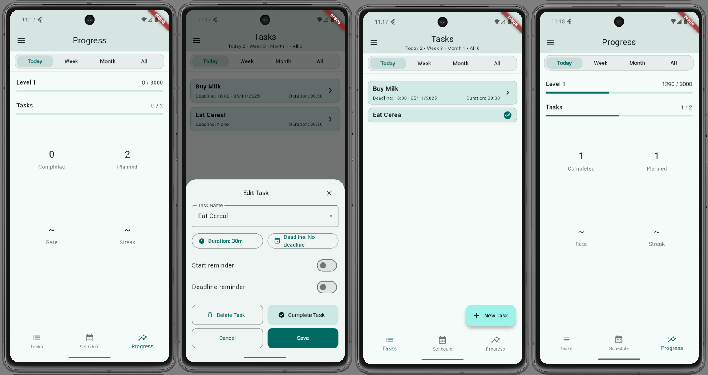

- Completing a task and then opening the **Progress** screen. The final image shows the updated level or experience bar, the current list progress bar, and updated counts.
